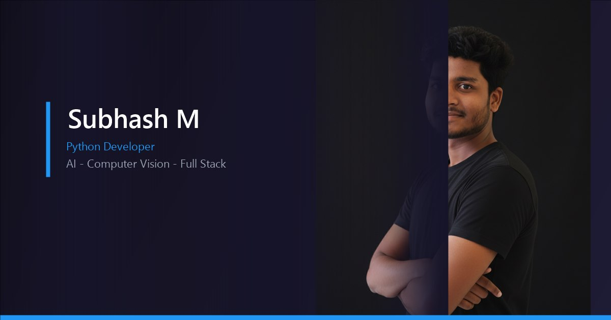
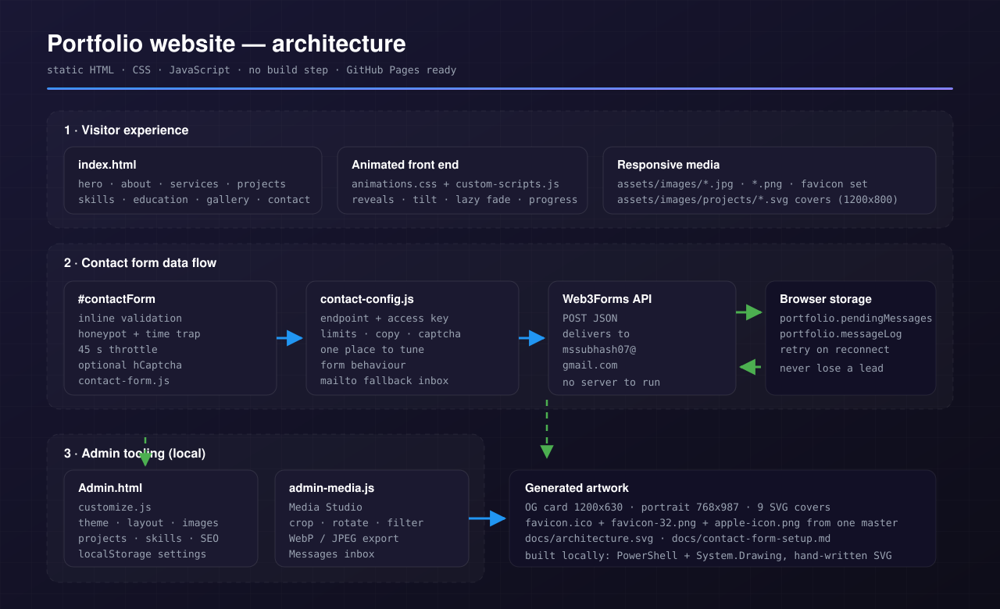
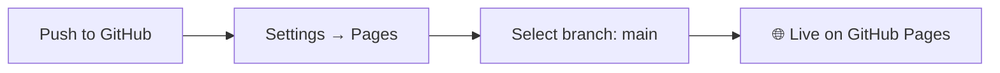
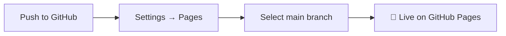

<div align="center">

<<<<<<< HEAD
<!-- Animated typing header -->


<br/>

# 🌐 Portfolio Website

**A responsive, dark-themed, single-page developer portfolio — fully static, zero backend, deploy-anywhere.**

<br/>

<!-- Badges -->
[](https://dr-leo-ms.github.io/portfolio-website/)
[](#-license)
[](#)
[](#)
[](#)

<br/>

[](https://dr-leo-ms.github.io/portfolio-website/)


</div>

<br/>

<p align="center">
  
  <b>No build step. No server. No dependencies to install. Just open and deploy.</b>
</p>

---

## 📖 Table of Contents

- [Live Demo](#-live-demo)
- [Preview](#-preview)
- [Features](#-features)
- [Tech Stack](#-tech-stack)
- [Project Architecture](#-project-architecture)
- [Getting Started](#-getting-started)
- [Configuration](#-configuration)
- [Project Sections](#-project-sections)
- [Contact Form](#-contact-form)
- [Admin Panel](#-admin-panel)
- [Contact Form Setup Guide](docs/contact-form-setup.md)
- [SEO & Accessibility](#-seo--accessibility)
- [Customization](#-customization)
- [Deployment](#-deployment)
- [Roadmap](#-roadmap)
- [License](#-license)
- [Credits](#-credits)
- [Connect](#-connect-with-me)

---

## 🚀 Live Demo

<div align="center">

### 👉 **[dr-leo-ms.github.io/portfolio-website](https://dr-leo-ms.github.io/portfolio-website/)** 👈

</div>

---

## 🖼️ Preview

<div align="center">


<sub>Screenshots live in <code>assets/</code>; the diagram below is generated from <code>docs/architecture.svg</code>.</sub>
</div>

---

## ✨ Features

| | |
|---|---|
| 📱 **Fully Responsive** | Built on Bootstrap 4 with a custom responsive layer for every screen size |
| 🌑 **Dark Themed** | Sleek `dark-vertion black-bg` styling made for developer portfolios |
| 🎬 **Scroll Animations** | Custom IntersectionObserver reveal engine plus CSS keyframes — no animation plugin required |
| 🧭 **One-Page Navigation** | Smooth scrolling with active-link highlighting via jQuery One Page Nav |
| 🖼️ **Project Gallery** | Fancybox lightbox previews for a polished project showcase |
| 📊 **Skills Visualization** | Animated progress bars + circular skill indicators |
| ✉️ **Contact Form** | Inline validation, honeypot + time trap + throttle, offline retry queue and a `mailto:` fallback — still **zero backend** |
| ⚡ **Lazy Loading** | Native `loading="lazy"` images with shimmer skeletons and an accessible fade-in |
| 🪶 **Tiny Payload** | Artwork optimised from ~5 MB down to ~560 KB, with hand-built SVG covers for every project |
| 🛠️ **Admin Studio** | `Admin.html` ships a Media Studio (crop, rotate, filter, WebP export) and a Messages inbox |
| 🔍 **SEO Optimized** | Open Graph, Twitter Cards, JSON-LD, `robots.txt`, `sitemap.xml` |
| ♿ **Accessible** | Skip links, keyboard focus states, ARIA attributes, semantic HTML |
| 🖨️ **Print Friendly** | Dedicated print stylesheet for offline reading |

---

## 🛠️ Tech Stack

<div align="center">


</div>

| Layer | Technology |
|---|---|
| Markup | HTML5 |
| Styling | CSS3, Bootstrap 4, custom animation layer (`animations.css`) |
| Icons | Font Awesome 4.7.0 |
| Scripting | JavaScript (ES5+), jQuery |
| Animation | Native IntersectionObserver + CSS keyframes, reduced-motion aware |
| Media | Optimised JPEG rasters + hand-authored SVG project covers |
| Lightbox | Fancybox 3 (`data-type="image"` so SVG covers open too) |
| Progress | circle-progress.js |
| Navigation | jQuery One Page Nav (`jquery.nav.js`) |
| Hosting | GitHub Pages |
| Forms | Web3Forms JSON endpoint, honeypot/throttle/hCaptcha, localStorage retry queue |

---

## 🏗️ Project Architecture



=======
<!-- Animated header banner -->


<!-- Typing animation -->
<a href="#">
  
</a>

<br/>

<!-- Badges -->
<p>
  <a href="https://dr-leo-ms.github.io/portfolio-website/"></a>
  <a href="https://github.com/Dr-LEO-MS/portfolio-website/stargazers"></a>
  <a href="https://github.com/Dr-LEO-MS/portfolio-website/network/members"></a>
  <a href="LICENSE"></a>
</p>

<p>
  
  
  
  
  
  
</p>

</div>

<br/>

## 🌟 Overview

A **responsive, single-page portfolio website** for **Subhash M**, a Python Full Stack Developer from Villupuram, Tamil Nadu. Built to showcase projects, skills, and education — with a contact form that works entirely through `mailto:`, so **no backend is required**. Deployed effortlessly on **GitHub Pages**.

> 💡 Zero build step. Zero server. Just clone, customize, and deploy.

<br/>

## 📸 Preview

<div align="center">
<!-- Replace with actual screenshot/GIF paths once available -->

<br/><br/>

</div>

<br/>

## ✨ Features

| | Feature | Description |
|---|---|---|
| 📱 | **Fully Responsive** | Built on Bootstrap 4 with a custom responsive layer for every screen size |
| 🌙 | **Dark Themed** | Sleek `dark-vertion black-bg` design tailored for a developer portfolio |
| 🎬 | **Scroll Animations** | Smooth entrance animations via WOW.js + Animate.css |
| 🧭 | **One-Page Navigation** | Smooth scrolling with active-link highlighting |
| 🖼️ | **Project Gallery** | Fancybox lightbox previews for project screenshots |
| 📊 | **Skills Visualization** | Animated progress bars and circular skill indicators |
| ✉️ | **Static Contact Form** | `mailto:`-based form — no server-side processing needed |
| 🔍 | **SEO Optimized** | Open Graph, Twitter Cards, JSON-LD, `robots.txt`, `sitemap.xml` |
| ♿ | **Accessible** | Skip links, keyboard focus states, ARIA attributes, semantic HTML |
| 🖨️ | **Print Friendly** | Dedicated print stylesheet for offline reading |

<br/>

## 🛠️ Tech Stack

<div align="center">

| Layer | Technology |
|:---:|:---:|
| **Markup** | HTML5 |
| **Styling** | CSS3 · Bootstrap 4 · Animate.css |
| **Icons** | Font Awesome 4.7.0 |
| **Scripting** | JavaScript (ES5+) · jQuery |
| **Animation** | WOW.js · Animate.css |
| **Carousel** | Owl Carousel 2 |
| **Lightbox** | Fancybox |
| **Progress** | circle-progress.js |
| **Navigation** | jQuery One Page Nav |
| **Hosting** | GitHub Pages |

</div>

<br/>

## 🗂️ Project Architecture
>>>>>>> 55fb0179a6abadfc2c1330a16faab6669fb191f5

```

portfolio-website/
├── index.html              # Single-page portfolio markup
<<<<<<< HEAD
├── Admin.html              # Local admin: theme, images, Media Studio, Messages inbox
├── robots.txt              # Search-engine crawl directives + sitemap reference
├── sitemap.xml             # Sitemap for search engines
├── README.md               # This file
=======
├── robots.txt              # Crawl directives + sitemap reference
├── sitemap.xml             # Sitemap for search engines
├── .gitignore              # Ignores OS/editor noise
├── README.md               # You are here 📍
>>>>>>> 55fb0179a6abadfc2c1330a16faab6669fb191f5
│
├── docs/
│   ├── architecture.svg            # Architecture diagram (embedded above)
│   └── contact-form-setup.md       # Step-by-step contact form guide
│
├── assets/
│   ├── css/
│   │   ├── styles.css              # Core template styles
│   │   ├── responsive.css          # Breakpoint overrides
<<<<<<< HEAD
│   │   ├── animations.css          # Reveal engine, lazy-image skeletons, magnetic buttons
│   │   ├── custom.css              # Accessibility, contact form UI, print styles
│   │   ├── customize.css           # Admin panel styling
│   │   └── colors/                 # Swappable accent palettes
│   ├── js/
│   │   ├── custom-scripts.js       # Front-end behaviour (reveals, tilt, lazy fade, nav)
│   │   ├── contact-config.js       # Contact form settings (endpoint, key, limits)
│   │   ├── contact-form.js         # Validation, spam protection, retry queue
│   │   ├── customize.js            # Admin settings manager + public API
│   │   └── admin-media.js          # Media Studio + Messages inbox
│   ├── plugins/                    # jQuery, Popper, Bootstrap, Isotope, Fancybox, circle-progress
│   ├── icons/                      # Font Awesome 4.7 assets
│   └── images/                     # Optimised hero/about art, OG card, favicons
│       └── projects/               # 9 SVG project covers (plus the real project screenshot)
│
└── demo/                           # Demo-only color switcher (optional)

```

---

## ⚡ Getting Started
=======
│   │   ├── custom.css              # Accessibility + print + fixes
│   │   └── colors/                 # Swappable accent palettes
│   │       ├── blue-munsell.css    ⭐ active
│   │       ├── blue.css
│   │       ├── green.css
│   │       ├── orange.css
│   │       ├── purple.css
│   │       ├── slate.css
│   │       └── yellow.css
│   │
│   ├── js/
│   │   └── custom-scripts.js       # All interactive behavior
│   │
│   ├── plugins/
│   │   ├── css/                    # Bootstrap, Owl, Animate, Fancybox
│   │   └── js/                     # jQuery, Popper, Bootstrap, WOW, etc.
│   │
│   ├── icons/                      # Font Awesome assets
│   └── images/                     # Photos, illustrations, favicon
│       └── portfolio/              # Project gallery images
│
└── demo/                           # Demo-only color switcher

```

<br/>

## 🚀 Getting Started
>>>>>>> 55fb0179a6abadfc2c1330a16faab6669fb191f5

### Prerequisites
No build tools or package managers required — just a modern browser and (optionally) a local static server.

<<<<<<< HEAD
No build step or package manager required — just plain HTML, CSS, and JavaScript.

- A modern browser (Chrome, Firefox, Edge, Safari)
- Any static file server for local preview

### Clone & Run

```bash
# Clone the repository
git clone https://github.com/Dr-LEO-MS/portfolio-website.git
cd portfolio-website
```

Because the contact form and plugins read files relative to the project root, previewing with a local server is recommended over opening `index.html` directly via `file://`.

**Using Python:**
```bash
python -m http.server 8000
# → open http://localhost:8000
```

**Using Node.js:**
```bash
=======
### Run Locally

**Clone the repo**
```

git clone https://github.com/Dr-LEO-MS/portfolio-website.git
cd portfolio-website

```

**Serve with Python**
```

python -m http.server 8000

# open [http://localhost:8000](http://localhost:8000)

```

**...or with Node.js**
```

>>>>>>> 55fb0179a6abadfc2c1330a16faab6669fb191f5
npx http-server .

```

<<<<<<< HEAD
---

## ⚙️ Configuration

Before deploying your own copy, update these:

| # | What | Where |
|---|---|---|
| 1 | **Personal details** — name, role, contact links, About text, Projects, Skills, Education | `index.html` |
| 2 | **Meta tags** — `<title>`, description, author, Open Graph, Twitter Card | `index.html` `<head>` |
| 3 | **Color accent** — swap the loaded stylesheet | `assets/css/colors/*.css` |
| 4 | **Email recipient** — update the `mailto:` action and links | `index.html` |
| 5 | **Canonical URL & sitemap** | `index.html`, `robots.txt`, `sitemap.xml` |
| 6 | **Contact form delivery** — Web3Forms access key, inbox, limits, captcha | `assets/js/contact-config.js` |
| 7 | **Admin password** — set on first visit to `Admin.html`, stored as a salted hash in `localStorage` | `Admin.html` |

---

## 🗂️ Project Sections

| Section ID | Anchor | Description |
|---|---|---|
| `#mh-header` | Header | Sticky navigation bar with smooth-scroll anchors |
| `#mh-home` | Home | Hero headline, tagline, quick contact, portrait |
| `#mh-about` | About | Bio, skills overview, and tech tags |
| `#mh-service` | Services | Service cards |
| `#mh-portfolio` | Portfolio | Featured projects with Fancybox previews |
| `#mh-skills` | Skills | Technical skill bars and professional skill circles |
| `#mh-education` | Education | Academic history and certifications |
| `#mh-contact` | Contact | Contact details + inline-validated `mailto:` form |

---

## 📬 Contact Form

Fully client-side, production hardened — no PHP, no Node service, no build step:

| Layer | File | Responsibility |
|---|---|---|
| Markup | `index.html` (`#contactForm`) | Accessible fields, inline error slots, honeypot, `aria-live` status banner |
| Settings | `assets/js/contact-config.js` | Endpoint, access key, inbox, limits, captcha, visitor-facing copy |
| Logic | `assets/js/contact-form.js` | Validation, spam protection, delivery, offline queue, automatic retries |

**Spam protection — layered, with no friction for real visitors**

1. Honeypot field: invisible to people, irresistible to bots
2. Time trap: anything submitted in under 4 seconds is dropped silently
3. Per-browser throttle: 45 seconds between submissions
4. Optional hCaptcha widget, injected only when a site key is configured

**Delivery that never loses a lead**

- Success → delivered by email and copied to `portfolio.messageLog`
- Failure or offline → stored in `portfolio.pendingMessages`, retried automatically when the browser reconnects, with a `mailto:` fallback offered inline

Add your own access key in `assets/js/contact-config.js` to switch email delivery on. The full
walkthrough, tuning table and testing checklist live in
**[docs/contact-form-setup.md](docs/contact-form-setup.md)**.

---

## 🛠️ Admin Panel

Open **`Admin.html`** and unlock it with the password you set on first visit — it is stored as a
salted hash in `localStorage`, never in plain text.

| Tool | What it does |
|---|---|
| 🎨 Visual theme | Accent colour, fonts, spacing and animation toggles with live preview |
| 🧩 Layout | Container width, grid gap and drag-and-drop section order |
| 🖼️ Image references | Re-point the hero, about and modal artwork by path or URL |
| 🗂️ Projects & skills | Add, edit, reorder and delete projects, gallery tags and skill bars |
| 📤 Media Studio | Drag-drop an image, crop / rotate / flip / filter it, export an optimised WebP or JPEG and apply it to a page slot — all inside the browser |
| 📥 Messages inbox | Every enquiry this browser handled, plus the retry queue, CSV export and one-click reply |
| 💾 Backup | Export or import the complete settings JSON, or reset to defaults |
| 🔐 Security | Password change with strength meter and inactivity auto-lock |

Settings live in `localStorage` and are broadcast to the live preview iframe, so the panel works
on a static host with no database and no server.

---

## 🔍 SEO & Accessibility

- 🏷️ Open Graph + Twitter Card meta tags for rich link previews
- 🧬 `application/ld+json` structured data (`Person` schema)
- 🗺️ `robots.txt` and `sitemap.xml` for discoverability
- 🧱 Semantic HTML sectioning with proper heading hierarchy
- ⌨️ Skip-link, visible focus styles, ARIA attributes for keyboard users
- 🖨️ Dedicated print stylesheet

---

## 🎨 Customization
=======
> ⚠️ Prefer a local server over opening `index.html` directly — the contact form and plugins load assets relative to the project root.

<br/>

## ⚙️ Configuration

Before deploying your own copy, update the following:

<details>
<summary><strong>1️⃣ Personal Details</strong> — <code>index.html</code></summary>
<br/>

- `<title>`, `<meta name="description">`, `<meta name="author">`
- Open Graph & Twitter Card tags
- Name, role, contact links, About text
- Projects, Skills, Education, and Contact/Footer content
</details>

<details>
<summary><strong>2️⃣ Accent Color</strong> — <code>index.html</code></summary>
<br/>

Swap the stylesheet link in `<head>` to one of:
`blue` · `green` · `blue-munsell` · `orange` · `purple` · `slate` · `yellow`
</details>

<details>
<summary><strong>3️⃣ Email Recipient</strong> — <code>index.html</code></summary>
<br/>

Update every `mailto:` occurrence to point to your own email address.
</details>

<details>
<summary><strong>4️⃣ Canonical URL & Sitemap</strong> — <code>index.html</code>, <code>robots.txt</code>, <code>sitemap.xml</code></summary>
<br/>

Point these to your live GitHub Pages URL or custom domain.
</details>

<br/>

## 🧭 Page Sections

| Section | Anchor | Description |
|---|---|---|
| `#mh-header` | Header | Sticky nav bar with smooth-scroll anchors |
| `#mh-home` | Home | Hero headline, tagline, quick contact, portrait |
| `#mh-about` | About | Bio, skills overview, tech tags |
| `#mh-service` | Services | Service cards |
| `#mh-portfolio` | Portfolio | Featured projects with Fancybox previews |
| `#mh-skills` | Skills | Skill bars and circular indicators |
| `#mh-education` | Education | Academic history and certifications |
| `#mh-contact` | Contact | Contact details + validated `mailto:` form |

<br/>
>>>>>>> 55fb0179a6abadfc2c1330a16faab6669fb191f5

## ✉️ Contact Form

<<<<<<< HEAD
Only one palette loads at a time. In `index.html`'s `<head>`, change:
=======
The form submits via `mailto:` with `enctype="text/plain"` — opening the visitor's default email client, pre-filled with their message. `custom-scripts.js` adds:
>>>>>>> 55fb0179a6abadfc2c1330a16faab6669fb191f5

- ✅ Inline validation via `validator.min.js` (graceful fallback if unavailable)
- 💬 Confirmation prompt: *"Opening your email app — press Send there to deliver your message."*
- ⌨️ Keyboard-accessible markup (`aria-label`, `sr-only`, `required`)

> There is **no** `process.php`, `email.php`, or any server-side script — this stays 100% static.

<br/>

## 🔍 SEO & Accessibility

- Open Graph + Twitter Card meta tags for rich link previews
- `application/ld+json` structured data (`Person` schema)
- `robots.txt` + `sitemap.xml` for discoverability
- Semantic HTML with proper heading hierarchy
- Skip links, visible focus states, ARIA attributes
- Dedicated print stylesheet

<br/>

## 🎨 Customization

**Change accent color** — edit the stylesheet reference in `index.html`:
```html
<link rel="stylesheet" href="assets/css/colors/blue-munsell.css">
```

<<<<<<< HEAD
Available options:

<div align="center">

`blue.css` · `green.css` · `blue-munsell.css` · `orange.css` · `purple.css` · `slate.css` · `yellow.css`

</div>
=======
**Change typography** — swap the Google Fonts `<link>` in `<head>` (default: Roboto).
>>>>>>> 55fb0179a6abadfc2c1330a16faab6669fb191f5

<br/>

<<<<<<< HEAD
Fonts load from Google Fonts in `index.html`'s `<head>`. Swap the Roboto link for any other Google Font family you prefer.

---

## 🚢 Deployment

<div align="center">



</div>

1. Push the repository to GitHub → `https://github.com/Dr-LEO-MS/portfolio-website`
2. Go to **Settings → Pages**, set source to the `main` branch
3. GitHub Pages automatically serves `index.html`

> Remember to update the canonical URL, Open Graph image, `sitemap.xml`, and `robots.txt` if you fork this project.

---

## 🗺️ Roadmap

- [ ] Add a blog/writing section
- [ ] Add light-mode theme toggle
- [ ] Add project filtering by tech stack
- [ ] Migrate contact form to a serverless form handler (optional upgrade)
- [ ] Add automated Lighthouse CI checks

---

## 📄 License

This project is based on the **Martan** HTML portfolio template, distributed under the **MIT License**. Custom content (text, images, skill data) is original to **Subhash M**.

---

## 🙌 Credits

| Component | Source |
|---|---|
| Template foundation | [Martan](https://html.design/) HTML5 portfolio template |
| Icons | [Font Awesome 4.7.0](https://fontawesome.com/) |
| Carousel | [Owl Carousel 2](https://owlcarousel2.github.io/OwlCarousel2/) |
| Lightbox | [Fancybox](https://fancyapps.com/fancybox-3/) |
| Animations | Native CSS keyframes + IntersectionObserver (no animation plugin) |
| Progress circles | [circle-progress](https://github.com/komarovsoft/circle-progress) |
| Fonts | [Google Fonts — Roboto](https://fonts.google.com/specimen/Roboto) |

---

## 🤝 Connect With Me

<div align="center">

[](https://dr-leo-ms.github.io/portfolio-website/)
[](mailto:mssubhash07@gmail.com)
[](https://github.com/Dr-LEO-MS)

<br/>

⭐ **If you found this project useful, consider giving it a star!** ⭐


</div>
=======
## 📦 Deployment (GitHub Pages)



1. Push this repository to GitHub.
2. Go to **Settings → Pages**.
3. Set the source branch to `main` (or `master`).
4. GitHub Pages automatically serves `index.html`.

> Don't forget to update the canonical URL, Open Graph image, sitemap, and `robots.txt` if you fork this project.

<br/>

## 📜 License

Built on the **Martan** HTML portfolio template, distributed under the **MIT License**.
All custom content (text, images, skill data) is original to Subhash M.

<br/>

## 🙌 Credits

| Resource | Author |
|---|---|
| Template foundation | [Martan](https://html.design/) |
| Icons | [Font Awesome 4.7.0](https://fontawesome.com/) |
| Carousel | [Owl Carousel 2](https://owlcarousel2.github.io/OwlCarousel2/) |
| Lightbox | [Fancybox](https://fancyapps.com/fancybox-3/) |
| Animations | [Animate.css](https://animate.style/) + WOW.js |
| Progress circles | [circle-progress](https://github.com/komarovsoft/circle-progress) |
| Fonts | [Google Fonts — Roboto](https://fonts.google.com/specimen/Roboto) |

<br/>

<div align="center">

### 📫 Let's Connect

<a href="mailto:mssubhash07@gmail.com"></a>


</div>
>>>>>>> 55fb0179a6abadfc2c1330a16faab6669fb191f5
