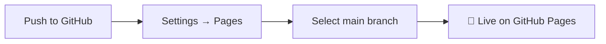

<div align="center">

<!-- Animated header banner -->


<!-- Typing animation -->
<a href="#">
  
</a>

<br/>

<!-- Badges -->
<p>
  <a href="https://dr-leo-ms.github.io/portfolio-website/"></a>
  <a href="https://github.com/Dr-LEO-MS/portfolio-website/stargazers"></a>
  <a href="https://github.com/Dr-LEO-MS/portfolio-website/network/members"></a>
  <a href="LICENSE"></a>
</p>

<p>
  
  
  
  
  
  
</p>

</div>

<br/>

## 🌟 Overview

A **responsive, single-page portfolio website** for **Subhash M**, a Python Full Stack Developer from Villupuram, Tamil Nadu. Built to showcase projects, skills, and education — with a contact form that works entirely through `mailto:`, so **no backend is required**. Deployed effortlessly on **GitHub Pages**.

> 💡 Zero build step. Zero server. Just clone, customize, and deploy.

<br/>

## 📸 Preview

<div align="center">
<!-- Replace with actual screenshot/GIF paths once available -->

<br/><br/>

</div>

<br/>

## ✨ Features

| | Feature | Description |
|---|---|---|
| 📱 | **Fully Responsive** | Built on Bootstrap 4 with a custom responsive layer for every screen size |
| 🌙 | **Dark Themed** | Sleek `dark-vertion black-bg` design tailored for a developer portfolio |
| 🎬 | **Scroll Animations** | Smooth entrance animations via WOW.js + Animate.css |
| 🧭 | **One-Page Navigation** | Smooth scrolling with active-link highlighting |
| 🖼️ | **Project Gallery** | Fancybox lightbox previews for project screenshots |
| 📊 | **Skills Visualization** | Animated progress bars and circular skill indicators |
| ✉️ | **Static Contact Form** | `mailto:`-based form — no server-side processing needed |
| 🔍 | **SEO Optimized** | Open Graph, Twitter Cards, JSON-LD, `robots.txt`, `sitemap.xml` |
| ♿ | **Accessible** | Skip links, keyboard focus states, ARIA attributes, semantic HTML |
| 🖨️ | **Print Friendly** | Dedicated print stylesheet for offline reading |

<br/>

## 🛠️ Tech Stack

<div align="center">

| Layer | Technology |
|:---:|:---:|
| **Markup** | HTML5 |
| **Styling** | CSS3 · Bootstrap 4 · Animate.css |
| **Icons** | Font Awesome 4.7.0 |
| **Scripting** | JavaScript (ES5+) · jQuery |
| **Animation** | WOW.js · Animate.css |
| **Carousel** | Owl Carousel 2 |
| **Lightbox** | Fancybox |
| **Progress** | circle-progress.js |
| **Navigation** | jQuery One Page Nav |
| **Hosting** | GitHub Pages |

</div>

<br/>

## 🗂️ Project Architecture

```

portfolio-website/
├── index.html              # Single-page portfolio markup
├── robots.txt              # Crawl directives + sitemap reference
├── sitemap.xml             # Sitemap for search engines
├── .gitignore              # Ignores OS/editor noise
├── README.md               # You are here 📍
│
├── assets/
│   ├── css/
│   │   ├── styles.css              # Core template styles
│   │   ├── responsive.css          # Breakpoint overrides
│   │   ├── custom.css              # Accessibility + print + fixes
│   │   └── colors/                 # Swappable accent palettes
│   │       ├── blue-munsell.css    ⭐ active
│   │       ├── blue.css
│   │       ├── green.css
│   │       ├── orange.css
│   │       ├── purple.css
│   │       ├── slate.css
│   │       └── yellow.css
│   │
│   ├── js/
│   │   └── custom-scripts.js       # All interactive behavior
│   │
│   ├── plugins/
│   │   ├── css/                    # Bootstrap, Owl, Animate, Fancybox
│   │   └── js/                     # jQuery, Popper, Bootstrap, WOW, etc.
│   │
│   ├── icons/                      # Font Awesome assets
│   └── images/                     # Photos, illustrations, favicon
│       └── portfolio/              # Project gallery images
│
└── demo/                           # Demo-only color switcher

```

<br/>

## 🚀 Getting Started

### Prerequisites
No build tools or package managers required — just a modern browser and (optionally) a local static server.

### Run Locally

**Clone the repo**
```

git clone https://github.com/Dr-LEO-MS/portfolio-website.git
cd portfolio-website

```

**Serve with Python**
```

python -m http.server 8000

# open [http://localhost:8000](http://localhost:8000)

```

**...or with Node.js**
```

npx http-server .

```

> ⚠️ Prefer a local server over opening `index.html` directly — the contact form and plugins load assets relative to the project root.

<br/>

## ⚙️ Configuration

Before deploying your own copy, update the following:

<details>
<summary><strong>1️⃣ Personal Details</strong> — <code>index.html</code></summary>
<br/>

- `<title>`, `<meta name="description">`, `<meta name="author">`
- Open Graph & Twitter Card tags
- Name, role, contact links, About text
- Projects, Skills, Education, and Contact/Footer content
</details>

<details>
<summary><strong>2️⃣ Accent Color</strong> — <code>index.html</code></summary>
<br/>

Swap the stylesheet link in `<head>` to one of:
`blue` · `green` · `blue-munsell` · `orange` · `purple` · `slate` · `yellow`
</details>

<details>
<summary><strong>3️⃣ Email Recipient</strong> — <code>index.html</code></summary>
<br/>

Update every `mailto:` occurrence to point to your own email address.
</details>

<details>
<summary><strong>4️⃣ Canonical URL & Sitemap</strong> — <code>index.html</code>, <code>robots.txt</code>, <code>sitemap.xml</code></summary>
<br/>

Point these to your live GitHub Pages URL or custom domain.
</details>

<br/>

## 🧭 Page Sections

| Section | Anchor | Description |
|---|---|---|
| `#mh-header` | Header | Sticky nav bar with smooth-scroll anchors |
| `#mh-home` | Home | Hero headline, tagline, quick contact, portrait |
| `#mh-about` | About | Bio, skills overview, tech tags |
| `#mh-service` | Services | Service cards |
| `#mh-portfolio` | Portfolio | Featured projects with Fancybox previews |
| `#mh-skills` | Skills | Skill bars and circular indicators |
| `#mh-education` | Education | Academic history and certifications |
| `#mh-contact` | Contact | Contact details + validated `mailto:` form |

<br/>

## ✉️ Contact Form

The form submits via `mailto:` with `enctype="text/plain"` — opening the visitor's default email client, pre-filled with their message. `custom-scripts.js` adds:

- ✅ Inline validation via `validator.min.js` (graceful fallback if unavailable)
- 💬 Confirmation prompt: *"Opening your email app — press Send there to deliver your message."*
- ⌨️ Keyboard-accessible markup (`aria-label`, `sr-only`, `required`)

> There is **no** `process.php`, `email.php`, or any server-side script — this stays 100% static.

<br/>

## 🔍 SEO & Accessibility

- Open Graph + Twitter Card meta tags for rich link previews
- `application/ld+json` structured data (`Person` schema)
- `robots.txt` + `sitemap.xml` for discoverability
- Semantic HTML with proper heading hierarchy
- Skip links, visible focus states, ARIA attributes
- Dedicated print stylesheet

<br/>

## 🎨 Customization

**Change accent color** — edit the stylesheet reference in `index.html`:
```html
<link rel="stylesheet" href="assets/css/colors/blue-munsell.css">
```

**Change typography** — swap the Google Fonts `<link>` in `<head>` (default: Roboto).

<br/>

## 📦 Deployment (GitHub Pages)



1. Push this repository to GitHub.
2. Go to **Settings → Pages**.
3. Set the source branch to `main` (or `master`).
4. GitHub Pages automatically serves `index.html`.

> Don't forget to update the canonical URL, Open Graph image, sitemap, and `robots.txt` if you fork this project.

<br/>

## 📜 License

Built on the **Martan** HTML portfolio template, distributed under the **MIT License**.
All custom content (text, images, skill data) is original to Subhash M.

<br/>

## 🙌 Credits

| Resource | Author |
|---|---|
| Template foundation | [Martan](https://html.design/) |
| Icons | [Font Awesome 4.7.0](https://fontawesome.com/) |
| Carousel | [Owl Carousel 2](https://owlcarousel2.github.io/OwlCarousel2/) |
| Lightbox | [Fancybox](https://fancyapps.com/fancybox-3/) |
| Animations | [Animate.css](https://animate.style/) + WOW.js |
| Progress circles | [circle-progress](https://github.com/komarovsoft/circle-progress) |
| Fonts | [Google Fonts — Roboto](https://fonts.google.com/specimen/Roboto) |

<br/>

<div align="center">

### 📫 Let's Connect

<a href="mailto:mssubhash07@gmail.com"></a>


</div>
